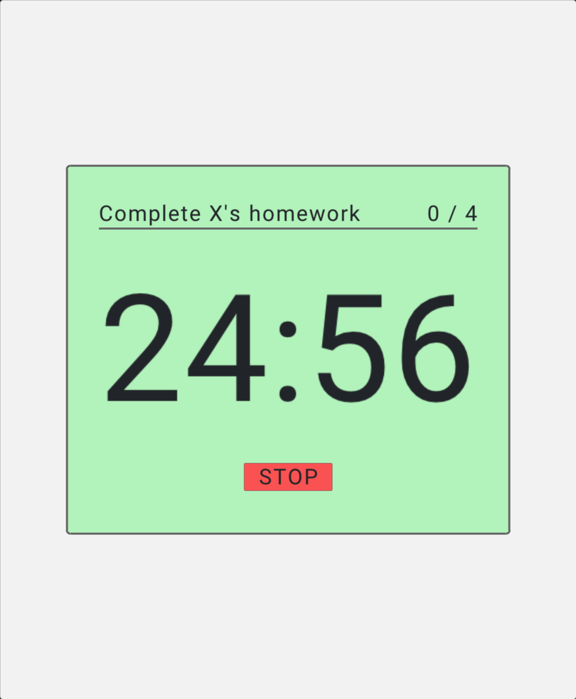
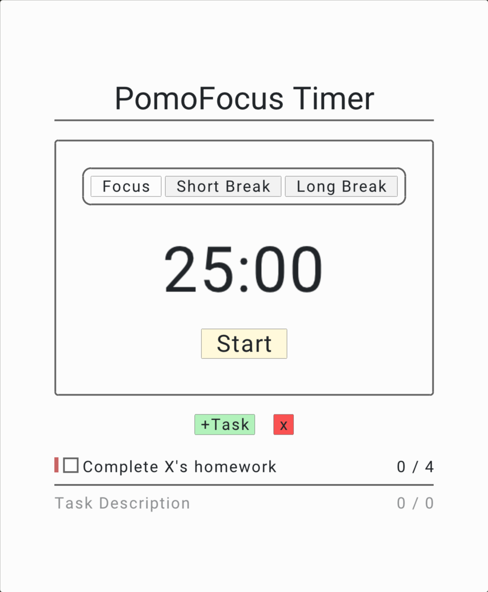

# PomoFocus Timer

A pomodoro timer made using:
- [Raylib](https://github.com/raysan5/raylib/)
- [cJSON](https://github.com/DaveGamble/cJSON)
- [CLAY](https://github.com/nicbarker/clay/)

## ScreenShots:

## Attributions
### Audio
- **Click Sound Effect**: [Universfield](https://pixabay.com/users/universfield-28281460/) via Pixabay.
- **Focus Sound Effect**: [freesound_community](https://pixabay.com/users/freesound_community-46691455/) via Pixabay.
- **Break Sound Effect**: [freesound_community](https://pixabay.com/users/freesound_community-46691455/) via Pixabay.

### Code & Logic
- **Time Handling**: Adapted from [Adam Rosenfield](https://stackoverflow.com/a/1442131) via Stack Overflow.
- **Responsive Scaling**: Logic based on [acerx-amj's responsive design blog](https://acerx-amj.github.io/blogs/responsive_design.html).
- Also thank you thag from Clay's Discord who helped me in getting through-text line rendering for completed task down.